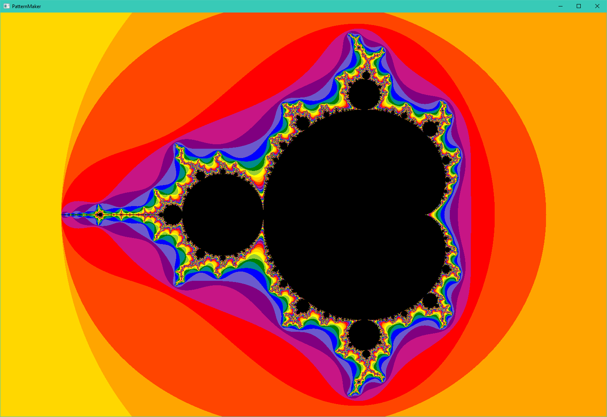
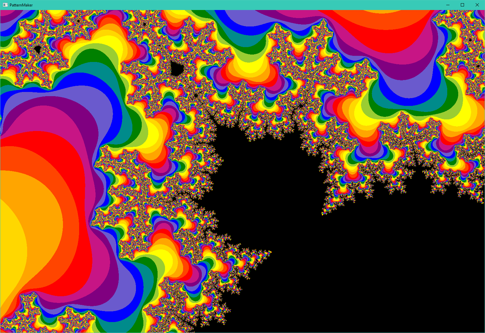
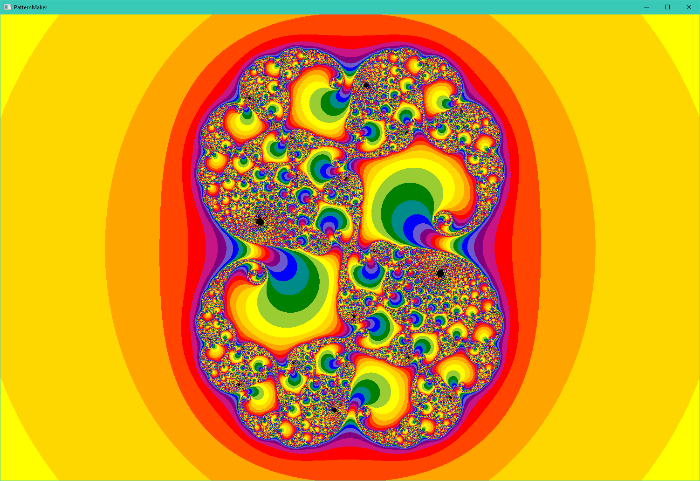

# Mandelbrot Explorer

## Main View

## Zoomed In on one of the bulbs in the top left of the main bulb

## A Julia Set from a position near the spike on the right

How to Run:

- Download source code
- Install [Java 8](https://www.oracle.com/java/technologies/downloads/#java8)
- navigate to the source code folder "src" in your command line
- run the command "javac *.java"
- run the command "java FractalViewer"
- enjoy :D

Controls:

 -	Arrow Keys: Move the screen around.
 -  W/S: Zoom in and out.
 -	Space: Increase the resolution of the set (does another 100 iterations).
 -	Esc: Resets the scene to the start.
 -	Enter: Toggleable, animates the iterations. Changes between running 100 steps when you make a change to running 1 step multiple times.
 -	Main Mouse (Left Click): Select a zone you wish to look at.
 -	Secondary Mouse (Right Click): Shows where the value goes after each step, keeping it in the black makes it loop.
 -  C: Centers the mouse position (Useful for zooming in on a black part, then zooming back out to see the whole fractal and then right clicking).
 -  J: Switch between the mandelbrot set and the julia set of the current center postition (Zoom in on a black pixel in the mandelbrot set and check out its julia set).
 -  M: Change from rainbow to red and orange (makes finding black pixels easier).
 
 You can change some of the variables at the start of the UI.java file to change some settings. 
