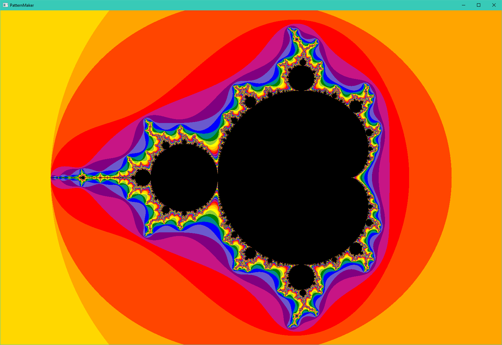
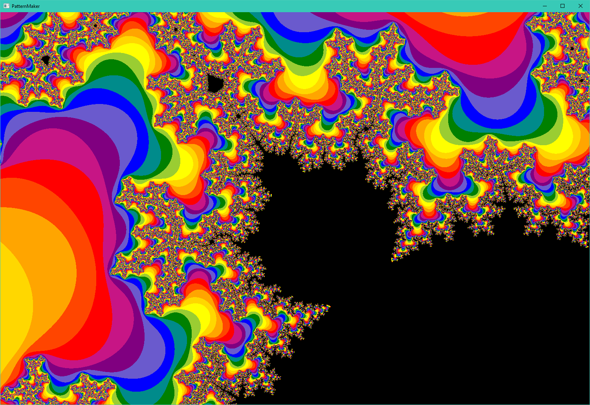

#Mandelbrot Explorer

How to Run:

- Download source code
- Install [Java 8](https://www.oracle.com/java/technologies/downloads/#java8)
- navigate to the source code folder "src" in your command line
- run the command "javac *.java"
- run the command "java FractalViewer"
- enjoy :D

Controls:

 -	Arrow Keys: Move the screen around
 -  W/S: Zoom in and out
 -	Space: Increase the resolution of the set (does another 100 iterations)
 -	Esc: Resets the scene to the start
 -	Enter: Toggleable, animates the iterations. Changes between running 100 steps when you make a change to running 1 step multiple times
 -	Main Mouse (Left Click): Select a zone you wish to look at
 -	Secondary Mouse (Right Click): Shows where the value goes after each step, keeping it in the black makes it loop
 
 You can change some of the variables at the start of the UI.java file to change some settings. Changing line 31 to true will show you the Julia set of current Julia input. Use the numbers printed in the console to find a cool black space on the Mandelbrot set and use that as the Julia X and Y. (Try out x=0, y=1)
